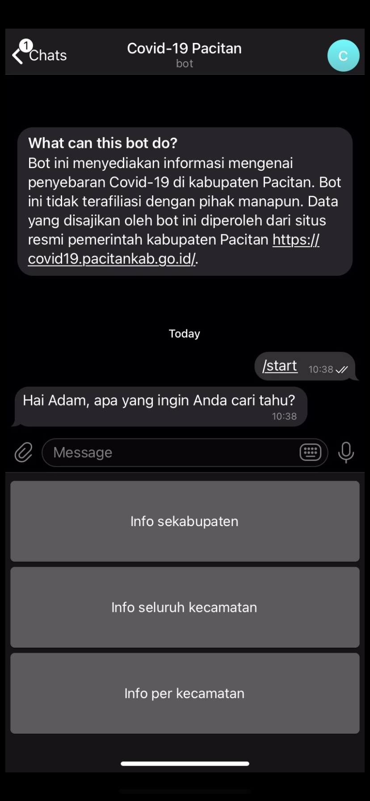
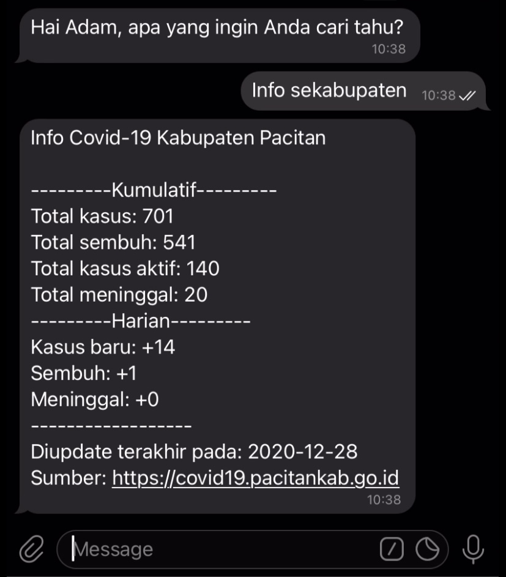

# telegram-bot-covid19-tracker
This is a telegram bot for tracking Covid-19 daily case in Pacitan regency, East Java, Indonesia.

 <strong>Currently this bot is offline.</strong> 

## How To Use
To start using the bot, type "/start" then submit. Once you have submitted, there will appear three buttons, as shown below.

 

### 1. Info sekabupaten
When this button is tapped, the bot will give information about Covid-19 case in the entire regency. 

 

### 2. Info seluruh kecamatan
When this button tapped, the bot will send information about Covid-19 active cases in all sub disctricts.

 

### 3. Info per kecamatan
When this button is tapped, there will appear several buttons, where each of them represents a sub district. 

 

You can tap one to see the active case in a particular sub disctrict.

 
